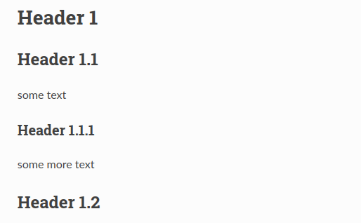

.. _code-rst-intro:

============
Introduction
============

reStructuredText
================

The official documentation uses reStructuredText (reST). The file ending of reST files is ``.rst``.

reStructuredText is a markup language for writing documentation. You can edit the source files using plain text and add reST markup where needed.

For example to create section headers, you use underlines:

.. code-block:: rst

   ========
   Header 1
   ========

   Header 1.1
   ==========

   some text

   Header 1.1.1
   ------------

   some more text

   Header 1.2
   ==========

This will create a header “Header 1” on level 1 and headers “Header 1.1” and “Header 1.2” on level 2 etc. The header level should reflect the structure of the content.::

   Header 1
   |-> Header 1.1
      |-> Header 1.1.1
   |-> Header 1.2

On the page you are looking at now, “Introduction” is a level 1 header (title) and “reST”, “Sphinx” etc. are level 2 headers.

The levels determine how the headers will be styled and also how they will be structured in the menu in the sidepanel.

Sphinx
======

While reStructuredText is the markup language, Sphinx is a suite of tools used to render the documentation. Rendering in this context means that an output format such as PDF or HTML is created from the source ``.rst`` files.

We will not go into the exact definition here. For now, all you need to know is that some of the markup you will be using is added on by Sphinx. This is the case for some additional directives such as:

* the :ref:`:ref: <code-rst-ref-links-cross-ref>` directive for cross-referencing
* the :ref:`toctree <code-rst-ref-hierarchy-structure>` directive for creating table of contents (=toc) and menus
* the :ref:`code-block <code-rst-code-blocks-codeblock>` directive for creating code blocks with syntax highlighting. ``code-block`` is a Sphinx directive, while ``code`` is a (native) reStructuredText directive. We commonly use ``code-block``, not ``code``.

Rendering
=========
The documentation source files will later be rendered into the output format (HTML) on our documentation server. The rendering is done automatically: If the source files change, they are rerendered.

Our headline example from above will look like this:

